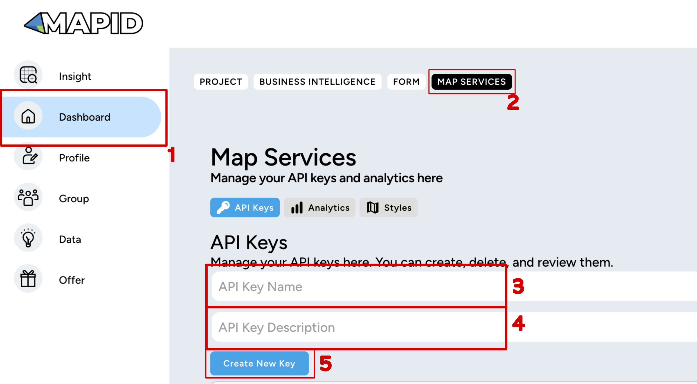
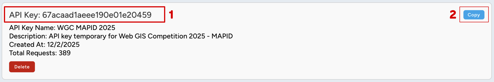

## 🔑 Cara Mendapatkan API Key Basemap
1. **Login** dengan akun perwakilan Tim
2. Pada Halaman Dashboard klik tombol **MAP SERVICES**

## Cara Generate API Key

1. Pergi ke halaman Dashboard
2. Klik tombol MAP SERVICES
3. Masukan API Key Name
4. Masukan API Key Description
5. Klik tombol Create New Key

## Menyalin API Key
Jika Generate API Key berhasil maka akan muncul list api key seperti berikut!

1. Pilih dan blok API Key dan copy (ctrl + c / klik kanan copy)
2. Atau klik tombol copy
