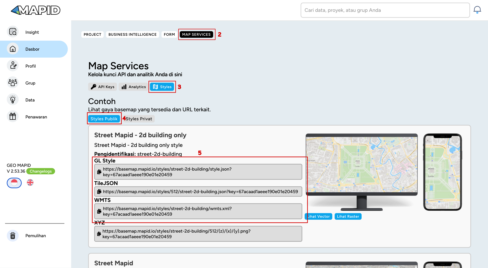

## 🌍 Pilihan Style Basemap
1. **Login** dengan akun perwakilan Tim
2. Pada Halaman Dashboard klik tombol **MAP SERVICES**
3. Klik tombol Style
4. Pilih Style Publik
5. Pilih basemap yang mau digunakan dan pilih format menggunakan GL Style, TileJSON atau WMTS. Sesuaikan dengan library maps yang digunakan

*Catatan: Tidak disarankan menggunakan XYZ (raster)